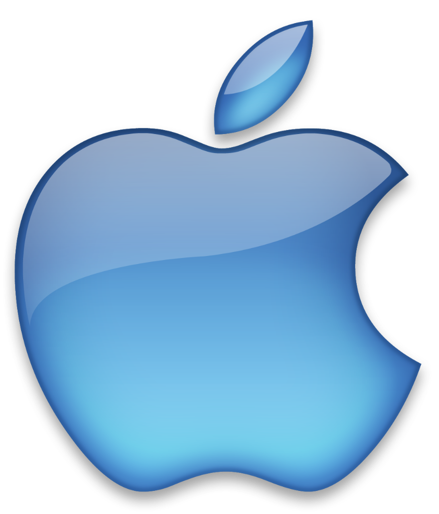

# Frutiger Aero Portfolio

> *"Humanism in Technology"*

A nostalgic, web-based operating system portfolio inspired by the **Frutiger Aero** and **Windows 7** design languages (2000s-2010s era). This project captures the optimism of mid-2000s tech with glossy textures, vibrant colors, and skeumorphic design.


## Features

- **Windows 7 Aero Glass UI**: Authentic glassmorphism with blur, reflection, and glow effects.
- **MacOS-style Dock**: Smooth, physics-based magnification animation using `framer-motion` springs.
- **Draggable Windows**: Fully interactive window management system with z-index stacking.
- **Project Folder System**: Integrated Finder-like file exploration with redirect links.
- **Dynamic Animations**: Fluid opening/closing transitions and hover effects.

## Gallery

| Project Finder | Projects Window |
|:---:|:---:|
|  | *Explore projects with a familiar interface* |

<p align="center">
  
  
</p>

## Tech Stack

- **React** components
- **Vite** for fast development
- **Framer Motion** for physics-based animations
- **CSS3** for glassmorphism and glossy textures (No external UI libraries)

## Getting Started

1. Clone the repository
2. Install dependencies:
   ```bash
   npm install
   ```
3. Run the development server:
   ```bash
   npm run dev
   ```

## Design Philosophy

This project aims to capture the **Frutiger Aero** aesthetic:
- **Skeuomorphism**: Realistic textures alongside digital interfaces.
- **Gloss & Glass**: Heavy use of transparency, reflections, and light.
- **Nature & Tech**: Combining organic imagery (aurora, water) with sleek hardware.
- **Vibrant Colors**: Optimistic blues, greens, and silvers.

---
*Created by Mukesh Kumar*
